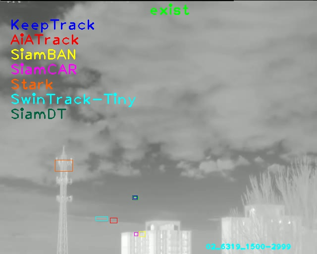
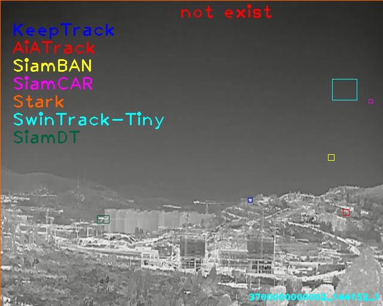
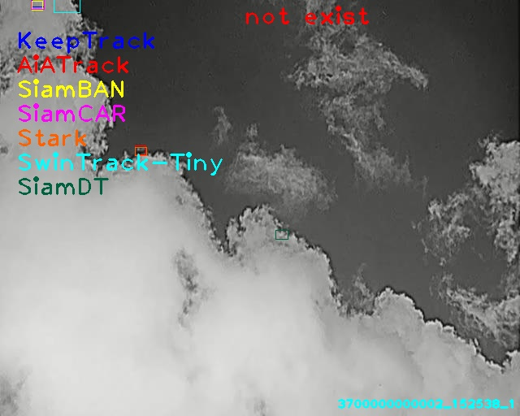

# Anti-UAV410 Benchmark

Anti-UAV410: A Thermal Infrared Benchmark and Customized Scheme for Tracking Drones in the Wild

This toolkit is used to evaluate trackers on generalized infrared UAV tracking benchmark called Anti-UAV410. The benchmark comprises a total of 410 videos with over 438K manually annotated bounding boxes.

## Preparing the dataset
Download the Anti-UAV410 dataset ([Google drive](https://drive.google.com/file/d/1zsdazmKS3mHaEZWS2BnqbYHPEcIaH5WR/view?usp=sharing) and [Baidu disk](https://pan.baidu.com/s/1R-L9gKIRowMgjjt52n48-g?pwd=a410) Access code: a410) to your disk, the organized directory should look like:

    ```
    --AntiUAV410/
    	|--test
    	|--train
    	|--val
    ```


## Installation and testing
**Step 1.** Create a conda environment and activate it.

```shell
conda create -n AntiUAV410 python=3.9.12
conda activate AntiUAV410
```

**Step 2.** Install the requirements.
```shell
pip install opencv-python, matplotlib, wget, shapely

pip install torch===1.9.1 -f https://download.pytorch.org/whl/torch_stable.html
pip install torchvision===0.10.1 -f https://download.pytorch.org/whl/torch_stable.html
```
Other versions of python, cuda and torch are also compatible.

**Step 3.** Testing the default SiamFC tracker.

Change the dataset_path in the Demo_for_tracking.py file to the path where the dataset is located.

Run
```shell
python Demo_for_tracking.py
```
The tracking results will be saved at project_dir/results/AntiUAV410/test/SiamFC.

**Step 4.** Downloading the tracking results compared in the paper.

Download the tracking results ([Google drive](https://drive.google.com/file/d/1zaNOoGZ2zXf-z3QoffgcH2W8HNxyR0kA/view?usp=sharing) and [Baidu disk](https://pan.baidu.com/s/169Gu_iDSVEBqu9Wz2hQA0g?pwd=a410) Access code: a410) to your project directory, the organized directory should look like:

    ```
    --project_dir/tracking_results/
    	|--Defaults
    	|--Trained_with_antiuav410
    ```

**Step 5.** Visual comparison.

Change the dataset path and select the trackers that need to be compared visually.

Run
```shell
python Demo_for_visual_comparison.py
```

The comparison figures will be saved at project_dir/figures/.
<!---

-->



``not exist'' in the figure means that the target is occluded or out of view.

**Step 6.** Evaluating the trackers.

Change the dataset path and edit project_dir/utils/trackers.py to select the trackers to be evaluated.

Run
```shell
python Evaluation_for_ALL.py
```


## Citation

If you find this project useful in your research, please consider cite:

```latex
@article{huang2023anti,
  title={Anti-UAV410: A Thermal Infrared Benchmark and Customized Scheme for Tracking Drones in the Wild},
  author={Huang, Bo and Li, Jianan and Chen, Junjie and Wang, Gang and Zhao, Jian and Xu, Tingfa},
  journal={IEEE Transactions on Pattern Analysis and Machine Intelligence},
  year={2023},
  publisher={IEEE}
}
```
